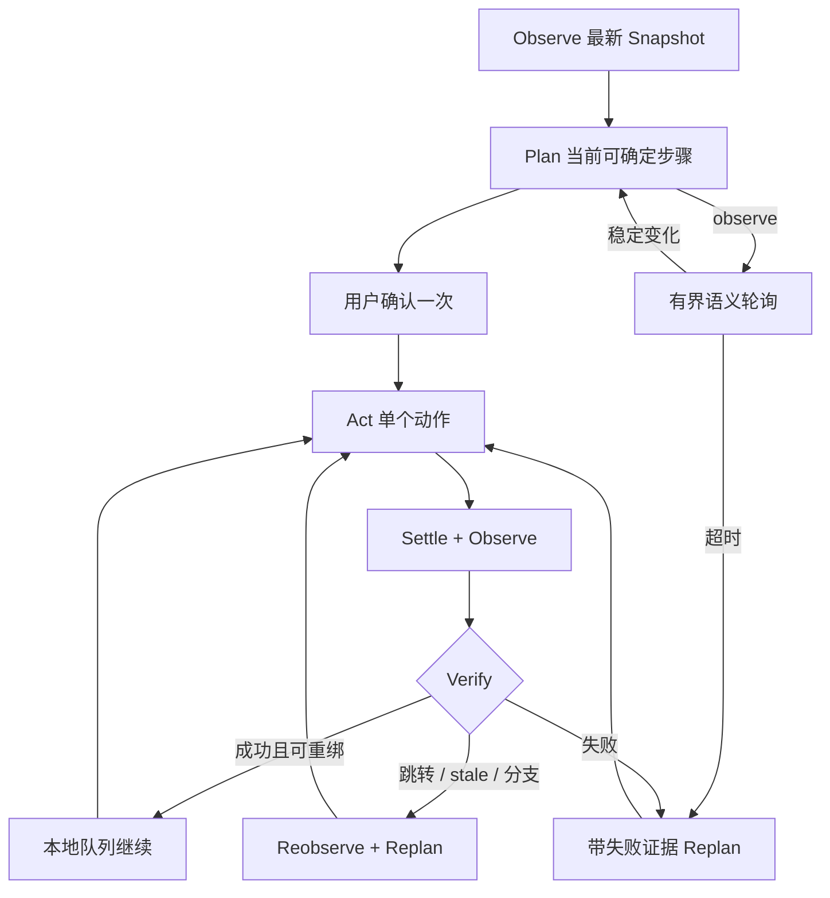

# Agent Runtime

## 1. 运行模型

运行时的真实流程是：

Observe 和 Plan 是内部状态，不生成虚假的 UI 时间线。时间线只记录真实 Action、Verify、Complete 和 Error。

## 2. 初始计划

Provider 应一次返回当前 Snapshot 中所有“目标已存在、顺序确定、不会跨页面分支”的步骤。例如金额、时长和 Next 同时可见时，应返回三步，而不是每步调用一次 Provider。

以下动作可以作为当前计划的最后一步，但不能在其后继续预排：

- 会导航或替换页面上下文；
- 会展开动态 combobox/menu；
- 会触发当前 Snapshot 中尚不存在的目标；
- 后续步骤依赖页面返回值或用户不可推断选择。

Bridge 对完整计划执行 fail-closed 校验：

- 最大 8 步；
- 所有非 scroll 目标必须存在于当前 Snapshot；
- 带目标的 scroll 必须指向 Snapshot 标记为 scrollable 的可信 ref；
- 任何一步无效都会拒绝整个计划，不做部分执行；
- `fill/select` 不能作用于 readonly、敏感或不可写目标；
- readonly combobox 不能 `fill/select`；可编辑的 input/textarea combobox 可用 `fill` 过滤选项；
- combobox filter fill 每个计划最多一个且必须是最后一步，过滤后的 option 必须来自 fresh Snapshot；
- 非原生 form 的 `submit` 归一化为 `click`；
- 分页 Next/Previous 每个计划最多一个，且必须是计划最后一步；
- 每个目标附加由 Bridge 生成的 `targetFingerprint`。

## 3. 本地队列与 ref 重绑

确认后 Background 每次只向 Content Script 发送一个动作。动作完成会生成新 Snapshot，因此原 ref 自动失效。

如果页面未跳转且动作验证成功，Background 用可信 fingerprint 在新 Snapshot 中查找下一目标：

- 唯一匹配：替换为新 ref，本地继续，不调用 Provider；
- 未找到或多义：丢弃剩余队列，携带 `snapshot_expired` 重新规划；
- popup 仍打开且下一目标位于外层：执行不进入 Provider action schema 的 popup housekeeping；
- URL 或页面上下文变化：丢弃剩余队列并 reobserve。

这使 Provider 调用边界保持清晰：队列结束、动态目标尚未出现、目标无法唯一重绑、验证失败或页面分支。

## 4. 页面跳转

### 跳转发生在动作之后

Content Script 通过以下信号区分导航：

- URL 变化；
- title、headings 或 mainText 形成新的有效页面上下文；
- 出现有意义的 `alert/status/dialog`；
- SPA 先创建空的 offscreen status，再延迟切换内容。

只有 URL 变化而目标页面内容未就绪时，状态是 `pending`。Content Script 在 bounded delayed observation 内继续观察；看到有效上下文后标记 `routeTransitioned`。

Background 收到跳转后：

1. 当前动作计入已执行；
2. 清空旧队列和旧失败计数；
3. 使用最新页面 Snapshot；
4. 将 `page_url_changed` 或 `page_context_changed` 传给 continuation；
5. Provider 只能从新 Snapshot 的 ref 重新规划。

导航本身永远不是任务完成证据。

### 跳转发生在动作派发前或派发期间

以下错误属于 reobserve，不是普通验证失败：

- `Page URL changed after the snapshot`
- `Page snapshot expired`
- `Target is unavailable`
- message port closed / receiving end missing
- extension context invalidated / frame removed

Content Script 的异步消息会把异常包装为 `{ ok:false,error }`。Background 必须同时分类“抛出的异常”和“返回对象中的 execution.error”；否则 stale action 会被误计为验证失败。

动作是否消耗预算取决于 `actionMayHaveExecuted`：

| 情况 | 消耗步骤 | 原因 |
| --- | --- | --- |
| URL/快照在派发前已过期 | 否 | 动作未执行 |
| 目标在派发前消失 | 否 | 动作未执行 |
| Content Script/Frame 在动作期间被替换 | 是 | 无法证明动作未执行 |
| 动作后确认导航 | 是 | 动作已执行 |

## 5. 动态控件

自定义 combobox 是明确分支：

1. readonly 或尚未展开的 combobox 先只计划 click；
2. Content Script 等待 `aria-controls/aria-owns` 对应 popup 的可见 option；
3. 如果目标 option 尚未出现，Provider 可对当前 Snapshot 中非 readonly 的 input/textarea combobox 执行一次 `fill`，仅用于搜索过滤；
4. click 或 filter fill 都是分支边界，必须位于计划末尾；
5. 捕获 fresh Snapshot，Provider 只能使用过滤后新生成的 option ref；
6. 验证 `aria-selected`、combobox `displayValue/selectedValues` 或 `activeDescendant`；
7. 多选时，Provider 返回当前 Snapshot 中全部确定且未选择的目标 option；
8. 同一 owner 仍有 queued option 时保持 popup 打开；
9. 下一目标在 popup 外或最后一个 option 已选完时，由 executor 关闭 popup，再进入下一字段。

旧 Snapshot 中不存在的 option 不能预排，也不能从截图生成坐标。

## 6. Observe 决策

`AgentDecision kind="observe"` 用于打包中、推送中、加载中或等待列表更新，不是 `BrowserAction`：

- Provider 只返回 `kind`、`reason` 和可选 `timeoutMs`；
- Bridge 与 Background 都把单次 timeout 限制在 30 秒内；
- Background 轮询 semantic snapshot signature，忽略 ref、时间戳和布局抖动；
- busy/progress 消失且有意义变化进入稳定窗口后才请求 continuation；
- 超时会明确 blocked，不把仍 busy 的最后快照当成 ready；
- observe 不消耗 50 动作预算，也不累计验证失败，但受全局 30 分钟预算。

不依赖站点专用状态文案，也不使用固定长 sleep。

## 7. 分页

分页仍使用普通 `click`。Snapshot 从 `aria-current`、`rel=next/prev` 和 navigation 可访问名称提取 `current/relation`。

点击 Next/Previous 后至少满足一项才成功：

- current page 语义变化；
- URL 变化；
- 有界列表/表格 collection signature 变化。

成功标记为 `page_content_changed`，丢弃上一页剩余队列和旧 ref，并从 fresh Snapshot 重新规划。disabled Next 保留在 Snapshot 供停止判断，但 Bridge 不允许点击。

## 8. 验证失败和恢复

验证失败不会自动重复相同动作。Continuation 收到：

- 最新 Snapshot；
- lastAction；
- lastVerification 与 Snapshot diff；
- remainingPlan；
- 当前 iteration、时间和步骤预算；
- 可选 reobserve / visualRecovery / completionEvidenceFailure。

连续三次执行/验证失败会停止。Stale/reobserve 不累计验证失败，也不消耗动作预算。

Provider 首次在异步边界返回 blocked 时，Background 可在同一边界执行一次 bounded readiness：

- 比较 URL、title、headings、mainText 和语义控件状态；
- 忽略 ref、snapshotId、时间戳和纯布局抖动；
- `aria-busy` 或 progressbar 持续存在时继续等待；
- 有意义变化稳定后只重新规划一次。

DOM 恢复仍不可操作时，可在满足安全条件下附加一次当前活动视口截图。截图只辅助理解，动作仍必须使用最新 DOM ref。

## 9. 完成语义

执行过浏览器动作后：

- `answer` 不能表示完成；
- `complete` 必须携带 1–3 条从最新 Snapshot 精确复制的文本或 URL；
- option 候选列表中的未选择文本不能作为完成证据；
- 证据无法匹配时只允许一次恢复 turn；
- 第二次仍无证据时报告“可能已提交，但无法确认完成”。

## 10. 预算与性能

单次 Provider Plan 仍限制为最多 8 步，避免动态页面中的 ref 在长计划内过期。整个 Agent 任务每轮限制为 50 个已执行动作、30 分钟、连续 3 次验证失败；stale/reobserve 不计入动作数。

达到 50 步或 30 分钟上限时，Background 不抛出终止错误，而是保留当前页面并返回可恢复的 `needs_user` 选择。用户确认继续后，从当前页面重新采集 Snapshot，并以原任务和用户的继续指令开启下一轮；旧 ref 和未执行队列不会跨轮复用。

主要耗时通常来自 Provider turn，而不是 DOM 方法本身。因此优化优先级是：

1. 同页稳定目标批量规划；
2. stale/context 错误直接 reobserve；
3. mutation/readiness 驱动的等待；
4. 缩短但保留可见的 AI 指针反馈；
5. 记录 Provider、执行、settle、snapshot 和 rebind 分段指标。

指标设计见 [diagnostics.md](diagnostics.md)。
