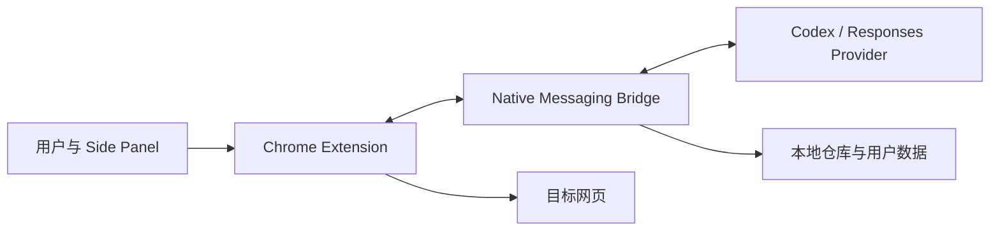
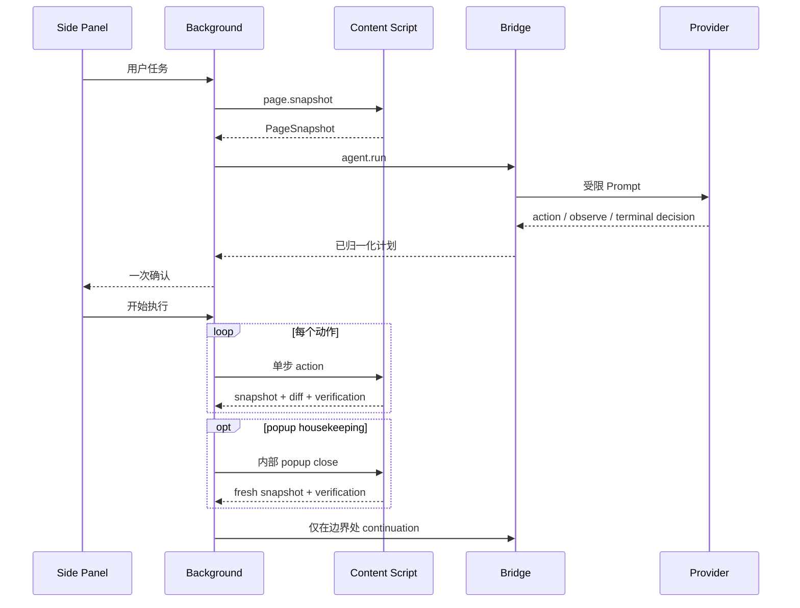

# 系统架构

## 1. 产品边界

Auto Page Agent 是本地优先的 Chrome MV3 Side Panel Agent。它把自然语言任务转换为受限浏览器动作，同时连接三类证据：



系统不是通用远程浏览器，也不是允许模型执行任意脚本的 RPA。所有浏览器动作必须使用最新页面快照中的临时 ref，并经过 Bridge 归一化、一次用户确认、Content Script 执行和页面状态验证。

## 2. 三个信任区

| 信任区 | 主要职责 | 明确不负责 |
| --- | --- | --- |
| `packages/extension` | Tab/对话绑定、Snapshot、确认 UI、动作执行、验证、截图、录制 | Provider 密钥、任意模型工具 |
| `packages/bridge` | Native Messaging、Provider、Prompt、决策校验、Skills、日志、仓库检索 | 直接持有网页 DOM、直接点击页面 |
| `packages/shared` | 跨进程类型与协议 | 业务执行和持久化 |

页面 DOM 节点只存在于 Content Script。Bridge 和 Provider 只看到压缩后的 `PageSnapshot`。Provider 返回的 `targetRef` 必须存在于该 Snapshot，Bridge 才会附加可信 `targetFingerprint`。

## 3. 进程与生命周期

### Chrome Extension

- Side Panel：对话、目标页摘要、初始计划确认、运行时间线、Skills 和录制管理。
- Background Service Worker：目标 Tab 路由、Native Messaging 连接、Agent loop、截图和待运行状态。
- Content Script：页面观察、临时 ref 表、受限动作、settle、diff 和验证。

Background 以 `windowId + conversationId + targetTabId` 作为不可变运行域。Chrome 当前激活 Tab 只影响浏览器焦点，不会在对话开始后改变 Agent 的目标页。

### Native Messaging Bridge

Bridge 注册为 `com.auto_page_agent.bridge`，由 Chrome 按需启动，不监听 TCP 端口。它负责：

1. 选择本地 Codex 或 Responses Provider；
2. 构造当前任务 Prompt；
3. 加载明确选择或推荐的 Skill；
4. 校验 Provider JSON 决策；
5. 持久化用户 Skills 和压缩后的对话日志；
6. 执行有边界的本地仓库证据检索。

Provider 的线程连续性由 Bridge 管理：Codex 使用 conversation 对应的 app-server thread；Responses 使用 `previous_response_id`。Extension 不感知 Provider 私有协议。

## 4. 核心数据流



详细的队列、页面跳转和恢复逻辑见 [agent-runtime.md](agent-runtime.md)。

## 5. 目录职责

### Extension

```text
packages/extension/src/
├── background.ts                 # 消息入口与 Agent loop
├── background/
│   ├── bridge-client.ts          # Native Messaging
│   ├── pending-agent-run.ts      # 待确认/恢复的运行域
│   ├── reobserve.ts              # stale/context 错误分类
│   ├── screenshot.ts             # 视口截图与视觉标记
│   ├── step-queue.ts             # fingerprint 重绑与 popup housekeeping
│   └── tabs.ts                   # 目标 Tab 读取与等待
├── content.ts                    # Content Script 入口
├── content/
│   ├── runtime.ts                # Snapshot、执行、settle、diff、验证
│   ├── action-settle.ts          # 分动作等待预算
│   ├── action-verification.ts    # 可观察效果与导航状态
│   ├── dom.ts                    # DOM 语义、可见性与输入
│   ├── dismiss.ts                # 安全外部点击定位
│   ├── recording.ts              # 录制与回放
│   └── snapshot-policy.ts        # 候选过滤和优先级
└── sidepanel/
    ├── controller.tsx            # UI 状态和工作流
    ├── conversation.ts           # 对话/续接纯逻辑
    └── components.tsx            # 展示组件
```

### Bridge

```text
packages/bridge/src/
├── index.ts                      # Native Host 入口
├── bridge/message-router.ts      # 请求路由、取消和响应
├── agent/
│   ├── router.ts                 # Provider 与 Skill 上下文
│   ├── prompt.ts                 # Prompt
│   ├── decision.ts               # fail-closed 校验
│   └── providers/                # Codex / Responses
├── codex-app-server.ts           # JSON-RPC 适配
├── skills/                       # Skill 校验、匹配与 workflow
├── logs.ts                       # 对话和操作日志
└── repositories.ts               # 固定字符串的 bounded rg
```

## 6. 持久化边界

- 仓库内 `skills/`：随版本发布的 Marketplace 模板。
- `~/.auto-page-agent/skills`：用户安装、自建或编辑的 Skills，升级不覆盖。
- `~/.auto-page-agent/logs`：压缩后的消息、目标页、续接状态和运行事件。
- `chrome.storage` / session：窗口对话、待选择内容、录制中的临时截图和 pending run。

不持久化截图 data URL、密码/OTP/支付字段值、完整 Snapshot、临时 ref、Provider 流片段或页面原始 HTML。

## 7. 架构约束

- Extension 始终拥有浏览器状态和执行权。
- Bridge 始终拥有 Provider 凭证和决策校验权。
- Provider 不能创建 selector、XPath、JavaScript 或坐标。
- Provider 不能请求 Escape 或 popup 外点；popup close 由 Extension 内部拥有。
- observe 不进入动作白名单，分页仍是 click，滚动容器必须使用最新可信 ref。
- Skills 只提供声明式上下文，不增加权限。
- 导航、页面替换和 stale ref 必须重新观察，不能重试旧动作。
- 页面动作成功不等于任务完成；完成必须匹配最新 Snapshot 中的精确证据。
